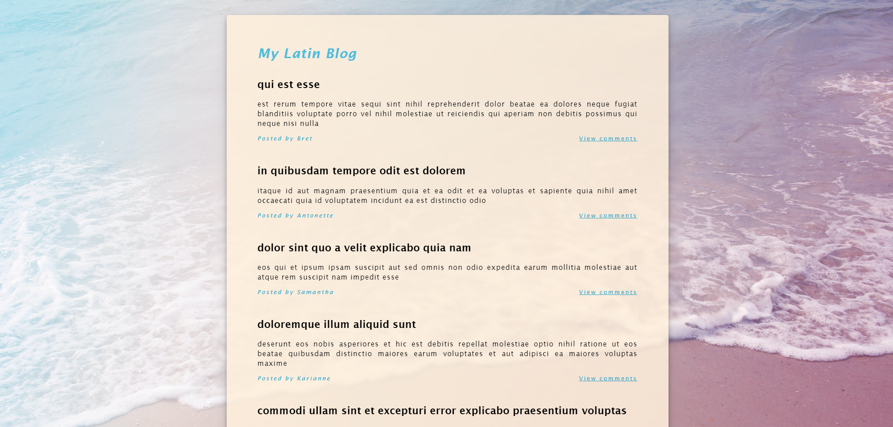

# 🌎 My Latin Blog

## 📌 Project Overview

**My Latin Blog** is a **web-based blog** that dynamically fetches and displays **posts from an external API**. Users can explore **blog posts, view detailed content, and toggle comments** for each post. The application ensures an engaging user experience by leveraging **JavaScript, API fetching, and dynamic content rendering**.

Developed as part of a **college assignment**, this project highlights **asynchronous data fetching, caching techniques, and user-friendly UI implementation**.

---

## 🚀 Features

- 📝 **Display Blog Posts** – Shows a list of posts, including **titles, content, and author names**.
- 💬 **View Comments** – Toggle comments for each post by clicking a **"View Comments"** link.
- 🚀 **Comment Caching** – Caches comments for each post to **reduce API calls** and enhance performance.
- 📱 **Responsive Design** – Adapts to different **screen sizes** for an optimal viewing experience.

---

## 🛠 Technologies Used

- **HTML5** → Structures the blog content and layout.
- **CSS3** → Provides styling for a **warm and inviting design**.
- **JavaScript (ES6)** → Handles **API interactions, DOM manipulation, and event-driven updates**.
- **jQuery** → Simplifies **AJAX requests** and UI interactions.
- **External API** → Utilizes `jsonplaceholder.typicode.com` as a **mock API** to fetch post and comment data.

---

## 🎯 Project Purpose

This project was developed as part of a **college assignment**, allowing me to practice:

- ✅ **Asynchronous API fetching** using `fetch()` and `async/await`.
- ✅ **Caching techniques** to optimize API calls and performance.
- ✅ **Event-driven UI interactions** for toggling comments dynamically.
- ✅ **Enhancing user experience** with smooth content updates.
- ✅ **Creating a scalable blog system** with modular and reusable code.

---

## 📂 Project Structure

```
📁 my_latin_blog
 ├── 📄 index.html          # Main HTML file for the blog
 ├── 📄 blog.css            # Stylesheet for layout and design
 ├── 📄 blog.js             # JavaScript for fetching data and managing interactivity
```

---

## 🏃‍♂️ How to Use the Application

1️⃣ **View Posts** – Open the blog, and the posts will display automatically.
2️⃣ **Toggle Comments** – Click the **"View Comments"** link below a post to expand and show comments. Click again to hide them.
3️⃣ **Explore** – Scroll through the blog to **read posts and comments**.

---

## 📝 Code Highlights

### **Fetching Data & Caching**
- **`fetchPosts` Function** (`blog.js`): Retrieves and dynamically displays blog posts.
- **`fetchComments` Function** (`blog.js`): Caches and retrieves comments efficiently to minimize API calls.

### **Dynamic Content Rendering**
- **`displayPosts` Function** – Generates blog post layouts dynamically.
- **`displayComments` Function** – Handles rendering of comments within the selected post.

---

## 🌟 Future Improvements

- 📜 **Pagination** – Add pagination or **infinite scrolling** for loading additional posts.
- 🖊 **User Comments** – Enable users to **add their own comments**.
- ⚠ **Error Handling** – Improve **user feedback** in case of API failures.
- 🎨 **UI Enhancements** – Add **animations and transitions** for smoother interactivity.

---

## 🎭 Screenshots  

| Blog Interface |  
|--------------|  
|  |  

---

## 📜 License

This project was developed for **educational purposes** as part of a **college assignment**.

---

## 💼 Author

👤 **Juan Jacobo Florez Monroy**  
🌐 **Portfolio**: [jjacobo95.com](https://jjacobo95.com)  
🐙 **GitHub**: [github.com/jjacoboflorez95](https://github.com/jjacoboflorez95)